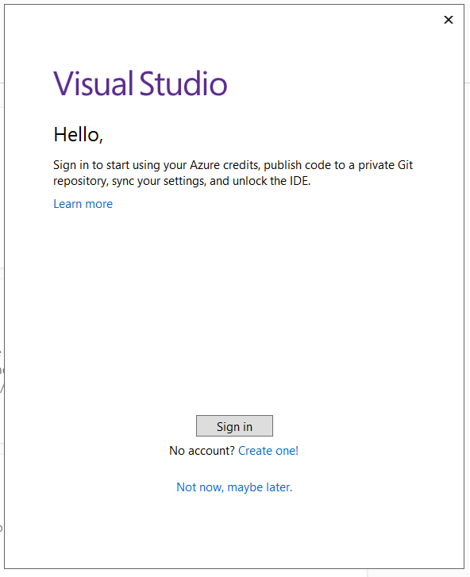
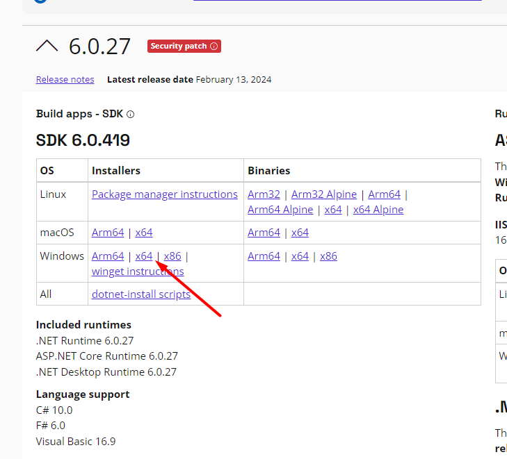

## How to install VS 2022 🎈
1. Download Visual Studio Community version from this link:

[Visual Studio Community](https://visualstudio.microsoft.com/vs/community/)

2. Check ASP.NET and web development box
3. Check the .NET desktop development box 

7. Click install and wait for the program to install
8. When it is installed open it and log in with a microsoft account

## Download .net6 SDK

1. Download .net6 sdk and runtime on this link:

[.Net SDK](https://dotnet.microsoft.com/en-us/download/dotnet/6.0)

## Now we are ready for new chalanges 

## Extra materials
* [Rextester - An online tool for running C#](https://rextester.com/)
* [DOT.NET Fiddle - An online tool for running C#](https://dotnetfiddle.net/)
